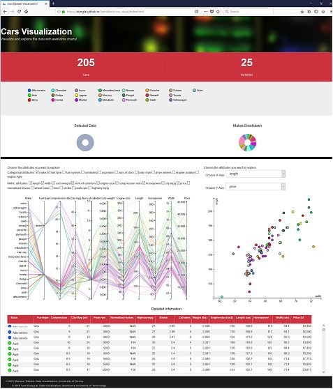

# [Click here to open web-based visualition](https://dunglai.github.io/SwinWork/cars-visual/index.html)

**The visualisation is tested in FireFox browser only**

[Click here for source code](https://github.com/DungLai/dunglai.github.io/blob/master/SwinWork/cars-visual)

Framework: [D3js](https://d3js.org/)

This visualization is developed upon the work of Mariano Trebino, University of Girona, 2015.

Developed further by Tuan Dung Lai, Swinburne University of Technology, Australia, 2018.

### d3 Cars dataset visualization

The primary question that could be answered by the visualisation is what types of car a brand normally makes and how the price and other factor of the cars are correlated. 

The visualisation allows users to analyze the different between products of various cars companies, including prices, brands and specification. Cars enthusiasts can research into the details of parts in a car and how they are related.

People who wish to buy cars can have better understanding of price range and specialization of varied brands in the car market. 

### Plots

This visualization uses a Parallel Coordinates Plot and Scatter Plot as the main plot and then three secondary plots: two donuts and one data table (SlickGrid library). All these plots all linked and synchronized. Any modification in any plot is translated to the others.

### Exploration

I provide many tools to explore the data. Try hovering the donuts, or the data table. Brush the parallel coordinates plot or sort the table!

1.	Checkbox area above the parallel coordinates plot lets users add or remove variables from the diagram.
2.	Scatter plot on the right utilizes the spare space and let users compare specific variables
3.	Dropdown menu lets users customize the variables for scatter plot.
4.	Brush filter technique is still applied when users change variables. In other words, users can highlight the range of data to visualize.
5.	Table data is updated regularly upon changes from the diagram.
6.	Scatter plot will change when the selected data from parallel coordinates plot is changed.
7.	Data points from scatter plot can be hovered and the corresponding data will be highlighted in the other diagram.
8.	Color scheme is consistent on both graphs and the table.

### Data

The data used in this example is contained in the folder assets/data in .csv format and can be found [here](http://archive.ics.uci.edu/ml/datasets/Automobile) 